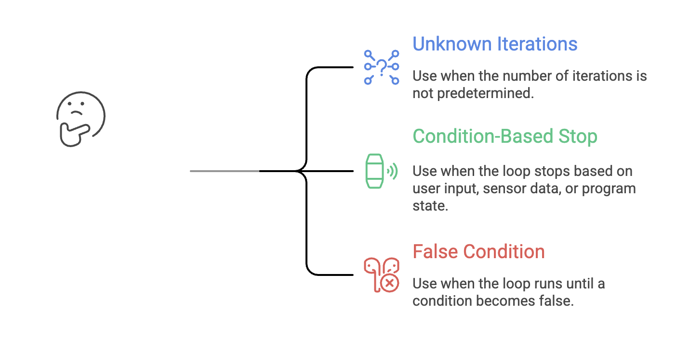

# While Loop in Python

In programming, **loops** are used to execute a block of code **multiple times** until a certain condition is met.

Loops reduce redundancy by allowing repetition of statements without writing them multiple times.

Python provides two types of loops:
1. **`for` loop**
2. **`while` loop**


## Understanding the `while` Loop

A **while loop** repeatedly executes a block of code **as long as a given condition remains True**.

It is ideal when:

* The number of iterations is **not fixed**.
* Repetition depends on a **condition** that changes over time.
* You want to loop until a certain state is reached.


---


## Structure of a While Loop

A proper `while` loop requires **three parts**:

| Step                   | Explanation                                                           |
| ---------------------- | --------------------------------------------------------------------- |
| **Initialization**     | Set a starting value (e.g., `i = 1`)                                  |
| **Condition**          | LOOP continues while the condition is True                            |
| **Update / Increment** | Modify the counter variable inside the loop to avoid infinite looping |


### Syntax

```python
i = starting_value   # Initialization

while condition:      # Condition
    statements
    i += 1            # Update
```


---


## Examples of While Loops

### Example 1 — Basic Loop

```python
i = 1
while i <= 5:
    print("Hello World")
    i += 1
print(i)
```

**Output:**

```
Hello World
Hello World
Hello World
Hello World
Hello World
5
```

### Example 2 — Decrementing Loop
```python
i = 5
while i >= 1:
    print("Telusko")
    i = i - 1
```

**Output:**
```
Telusko
Telusko
Telusko
Telusko
Telusko
```

### Example 3 — Printing Counter Values
```python
i = 5
while i >= 1:
    print("Telusko", i)
    i = i - 1
```

**Output:**
```
Telusko 5
Telusko 4
Telusko 3
Telusko 2
Telusko 1
```


---


## Infinite Loops

A `while` loop **without an update** or with a condition that is always True can cause your CPU usage to spike.

Example of an infinite loop:

```python
while True:
    print("Hello")
```

This loop **never ends** because the condition is always True.


---


## Using the `end` Parameter in print()

By default, `print()` ends with a newline (`\n`).
You can change this behaviour using `end`.

| Usage      | Meaning                                         |
| ---------- | ------------------------------------------------| 
| `end="\n"` | Default – prints each output on a new line      |
| `end=" "`  | Prints output in the same line with a space.    |
| `end=""`   | Prints outputs continuously without any space.  |

### Syntax:
```python
print(value, end=' ')
```

### Example

```python
i = 1
while i <= 5:
    print("Telusko ", end="")
    print("Rocks!! Rocks!! ")
    i += 1
print(i)
```

**Output (single line per loop):**

```
Telusko Rocks!! Rocks!!
Telusko Rocks!! Rocks!!
Telusko Rocks!! Rocks!!
Telusko Rocks!! Rocks!!
Telusko Rocks!! Rocks!!

```


---


## Nested While Loops

A **nested while loop** means having one loop inside another.
The inner loop completely executes for every iteration of the outer loop.
- To make the nested loop work correctly for each iteration of the outer loop, we reset `j` inside the outer loop:

### Example

```python
i = 1
while i <= 5:
    print("Telusko ", end="")
    j = 1
    while j <= 4:
        print("Rocks!! Rocks!! ", end="")
        j += 1
    i += 1
    print()
```

**Output:**

```
Telusko Rocks!! Rocks!! Rocks!! Rocks!!
Telusko Rocks!! Rocks!! Rocks!! Rocks!!
Telusko Rocks!! Rocks!! Rocks!! Rocks!!
Telusko Rocks!! Rocks!! Rocks!! Rocks!!
Telusko Rocks!! Rocks!! Rocks!! Rocks!!
```

- Each `Telusko` is now followed by 4 `Rocks` lines.

> If you do not reset the inner loop variable (`j`) **inside** the outer loop, the inner loop will run **only once**, not repeatedly.

  
---


## When to Use a While Loop



Examples:

* Continuously taking user input until they press ‘exit’
* Waiting for a file to be created
* Repeating tasks until a certain condition becomes False


---


## Summary

| Concept                 | Explanation                                               |
| ----------------------- | --------------------------------------------------------- |
| **While Loop**          | Repeats code as long as the condition is True             |
| **Initialization**      | Sets the starting value before entering the loop                                |
| **Condition**           | Controls loop execution                                   |
| **Increment/Decrement** | Changes the loop variable to eventually stop the loop                                 |
| **Nested While Loops**  | Inner loop runs fully for each outer loop iteration       |
| **end Parameter**       | Controls how print outputs appear (same line vs new line) |
