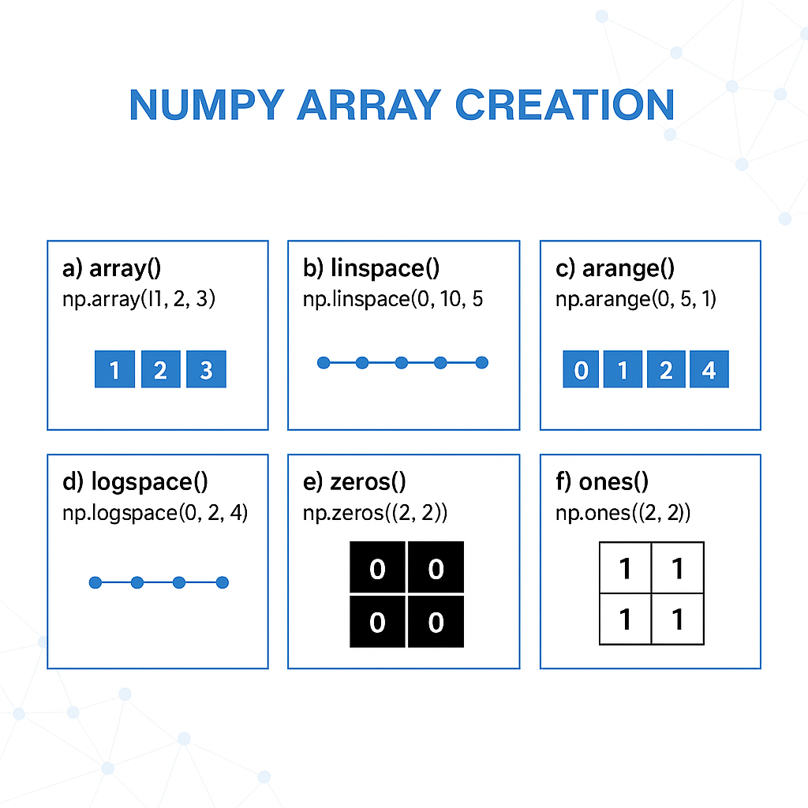

# 29. Ways of Creating Arrays in NumPy

## Introduction

In this lecture, we will explore the different ways to create arrays in NumPy.  

**NumPy** provides several functions that allow users to create arrays with specific values, patterns, or intervals.  
These functions make array creation flexible and efficient for data analysis, scientific computation, and machine learning applications.


## Ways of Creating Arrays in NumPy

NumPy offers **six primary ways** to create arrays:

1. `array()`  
2. `linspace()`  
3. `arange()`  
4. `logspace()`  
5. `zeros()`  
6. `ones()`





---


## 1. Using `array()`

The simplest way to create a NumPy array is by using the `array()` function.  
It can automatically detect the data type or can be manually specified.

### Syntax
```python
numpy.array(object, dtype=None)
````

### Example

```python
from numpy import *

# Integer array
arr = array([1, 2, 3, 4, 5])
print(arr)
print(arr.dtype)   # int32

# Mixed type array (automatic conversion)
arr = array([1, 2, 3, 4, 5.0])
print(arr.dtype)   # float64

# Specifying data type explicitly
arr = array([1, 2, 3, 4, 5], float)
print(arr.dtype)   # float64
```

> NumPy automatically converts data to a **common compatible type** if a mismatch occurs.


---


## 2. Using `linspace()`

`linspace()` is used to create an array with **evenly spaced values** over a specified interval.

### Syntax

```python
numpy.linspace(start, stop, num=50, endpoint=True, retstep=False, dtype=None)
```

### Example

```python
from numpy import *

arr = linspace(0, 15, 16)
print(arr)
```

This will create 16 equally spaced values from 0 to 15.
> By default, if `num` is not provided, it creates **50 elements**.


---


## 3. Using `arange()`

`arange()` is similar to Python’s built-in `range()` but returns a NumPy array instead of a list.
It creates values at **equal intervals**, defined by a step size.

### Syntax

```python
numpy.arange(start, stop, step, dtype=None)
```

### Example

```python
arr = arange(1, 15, 2)
print(arr)

arr = arange(1, 15, 2.5)
print(arr)
```

Output:

```
[ 1  3  5  7  9 11 13]
[ 1.  3.5  6.  8.5 11. 13.5]
```


---


## 4. Using `logspace()`

`logspace()` creates an array of numbers that are **evenly spaced on a log scale** (i.e., powers of a base value).

### Syntax

```python
numpy.logspace(start, stop, num=50, endpoint=True, base=10.0, dtype=None)
```

### Example

```python
arr = logspace(1, 40, 5)
print(arr)
```

Output:

```
[1.00000000e+01 1.00000000e+11 1.00000000e+21 1.00000000e+31 1.00000000e+40]
```

Here, the numbers range from 10¹ to 10⁴⁰, divided into 5 parts.


---


## 5. Using `zeros()`

`zeros()` creates an array filled entirely with zeros.
Useful for initializing arrays before assigning values.

### Syntax

```python
numpy.zeros(shape, dtype=float, order='C')
```

### Example

```python
arr = zeros(5)
print(arr)
```

Output:

```
[0. 0. 0. 0. 0.]
```

You can also create **multi-dimensional zero arrays**:

```python
arr = zeros((2, 3))
print(arr)
```


---


## 6. Using `ones()`

`ones()` creates an array filled entirely with ones.

### Syntax

```python
numpy.ones(shape, dtype=float, order='C')
```

### Example

```python
arr = ones(5)
print(arr)

arr = ones(4, int)
print(arr)
```

Output:

```
[1. 1. 1. 1. 1.]
[1 1 1 1]
```


---


## Comparison Table

| Function     | Description                                 | Example            | Output                    |
| ------------ | ------------------------------------------- | ------------------ | ------------------------- |
| `array()`    | Creates array from list or tuple            | `array([1,2,3])`   | `[1 2 3]`                 |
| `linspace()` | Creates evenly spaced values between limits | `linspace(0,10,5)` | `[0. 2.5 5. 7.5 10.]`     |
| `arange()`   | Creates range with custom step              | `arange(1,10,2)`   | `[1 3 5 7 9]`             |
| `logspace()` | Creates values spaced evenly in log scale   | `logspace(1,4,4)`  | `[10. 100. 1000. 10000.]` |
| `zeros()`    | Creates array filled with zeros             | `zeros(4)`         | `[0. 0. 0. 0.]`           |
| `ones()`     | Creates array filled with ones              | `ones(4)`          | `[1. 1. 1. 1.]`           |


