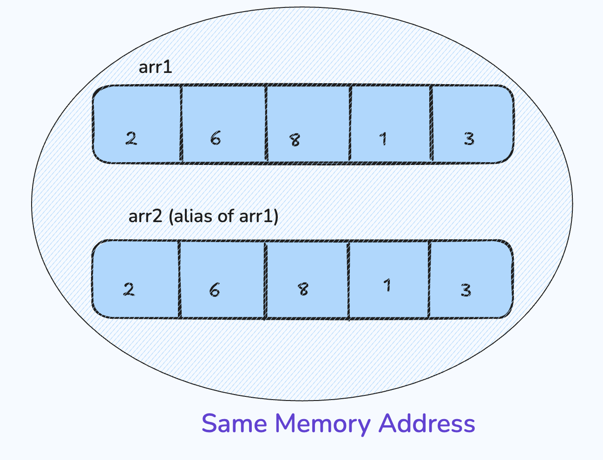

# Copying an Array in Python

In this lecture, we will learn:

* How to perform **addition** and **mathematical operations** on NumPy arrays
* What is **aliasing** in Python
* Different ways of **copying arrays**
* The concepts of **shallow** and **deep copies**


## Adding Values in NumPy Arrays

NumPy allows easy element-wise operations on arrays. You can perform arithmetic operations directly without using loops — this is known as **vectorized operation**.

### Example: Adding a Scalar Value to an Array

```python
from numpy import *

arr = array([1, 2, 3, 4, 5])
arr = arr + 5
print(arr)
```

**Output:**

```
[ 6  7  8  9 10 ]
```

Here, **5 is added to each element** of the array.


---


## Adding Two Arrays (Vectorized Operation)

We can also add two arrays of the same shape directly.

```python
from numpy import *

arr1 = array([1, 2, 3, 4, 5])
arr2 = array([6, 1, 9, 3, 2])

arr3 = arr1 + arr2
print(arr3)
```

**Output:**

```
[ 7  3 12  7  7 ]
```

> This operation is called a **Vectorized Operation** because it applies element-wise addition without explicit looping.


---


## Mathematical Functions on Arrays

NumPy supports various **mathematical functions** that work element-wise on arrays:

```python
from numpy import *

arr = array([1, 2, 3, 4, 5])

print(sin(arr))
print(cos(arr))
print(log(arr))
print(sqrt(arr))
```

**Output:**

```
[0.841 0.909 0.141 -0.757 -0.959]
[0.540 -0.416 -0.990 -0.653  0.284]
[0.000 0.693 1.098 1.386 1.609]
[1.000 1.414 1.732 2.000 2.236]
```

You can also use built-in aggregation functions:

```python
print(sum(arr))  # Sum of all elements
print(min(arr))  # Minimum value
print(max(arr))  # Maximum value
```


---


## Concatenating Arrays

You can combine two arrays using `concatenate()`:

```python
from numpy import *

arr1 = array([1, 2, 3, 4, 5])
arr2 = array([6, 1, 9, 3, 2])

arr3 = concatenate([arr1, arr2])
print(arr3)
```

**Output:**

```
[1 2 3 4 5 6 1 9 3 2]
```


---


## Understanding Aliasing in Python

**Aliasing** occurs when two variables refer to the **same memory location**.
Any modification made through one variable will reflect in the other.

### Example: Aliasing

```python
from numpy import *

arr1 = array([2, 6, 8, 1, 3])
arr2 = arr1  # arr2 is an alias of arr1

print(id(arr1))
print(id(arr2))
```

> Both IDs will be the same — meaning both variables point to the same array.




---


## Creating a New Array with `view()`

If we want a **new array** stored at a **different memory location**, we use the `view()` function.

```python
arr1 = array([2, 6, 8, 1, 3])
arr2 = arr1.view()

print(id(arr1))
print(id(arr2))
```

> Both IDs are **different**, meaning they are two separate arrays.


---


## Types of Copying in NumPy

There are **two types of array copying** techniques:

| Copy Type        | Function | Memory Address | Changes Reflected |
| ---------------- | -------- | -------------- | ----------------- |
| **Shallow Copy** | `view()` | Different      | ✅ Yes             |
| **Deep Copy**    | `copy()` | Different      | ❌ No              |


### Shallow Copy

In a **shallow copy**, a new array is created at a different memory location,
but the **data elements are still shared** between both arrays.

```python
arr1 = array([2, 6, 8, 1, 3])
arr2 = arr1.view()

arr1[1] = 7

print(arr1)
print(arr2)
```

**Output:**

```
[2 7 8 1 3]
[2 7 8 1 3]
```

> Both arrays reflect the change because they share the same data buffer.


```
arr1 (data) ─┐
              ├──► [2,7,8,1,3]
arr2 (view) ─┘
```


### Deep Copy

In a **deep copy**, both arrays are **completely independent**.
Changes in one array will **not** affect the other.

```python
arr1 = array([2, 6, 8, 1, 3])
arr2 = arr1.copy()

arr1[1] = 7

print(arr1)
print(arr2)
```

**Output:**

```
[2 7 8 1 3]
[2 6 8 1 3]
```

> Both arrays are stored at **different memory locations**,
and the change in `arr1` does **not** affect `arr2`.


```
arr1 ──► [2,7,8,1,3]
arr2 ──► [2,6,8,1,3]
Completely separate arrays
```


---


## Summary

| Concept                  | Description                                   |
| ------------------------ | --------------------------------------------- |
| **Vectorized Operation** | Performing arithmetic on arrays without loops |
| **Aliasing**             | Two variables refer to the same memory        |
| **view()**               | Creates a shallow copy                        |
| **copy()**               | Creates a deep copy                           |
| **Deep Copy**            | Independent arrays                            |
| **Shallow Copy**         | Shared data buffer                            |

