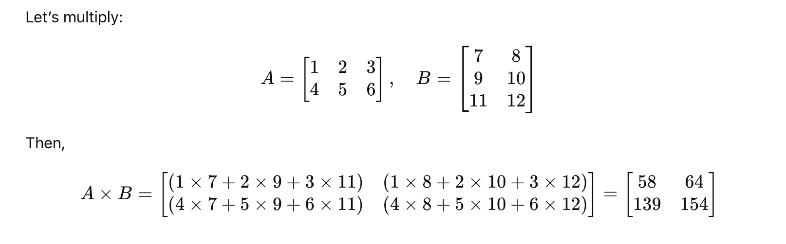

# Working with Matrix in Python

## Understanding Multi-Dimensional Arrays

An **array** is a collection of multiple elements of the same type.
When an array contains another array as its element, it becomes a **multi-dimensional array**.

A **two-dimensional (2-D) array** can be visualized as data arranged in **rows and columns**, like a table or spreadsheet.

### Syntax of a 2-Dimensional Array

```python
arr = array([
    [arr1],
    [arr2]
])
```

### Example:

```python
from numpy import *

arr1 = array([
    [1, 2, 3],
    [4, 5, 6]
])
print(arr1)
```

**Output:**

```
[[1 2 3]
 [4 5 6]]
```


---


## Attributes of Two-Dimensional Arrays

NumPy arrays come with several useful attributes that provide information about their structure and contents.

| Attribute   | Description                                       | Example            |
| ----------- | ------------------------------------------------- | ------------------ |
| `dtype`     | Returns the data type of array elements           | `print(arr.dtype)` |
| `ndim`      | Returns the number of dimensions (rank)           | `print(arr.ndim)`  |
| `shape`     | Returns the number of rows and columns as a tuple | `print(arr.shape)` |
| `size`      | Returns the total number of elements in the array | `print(arr.size)`  |
| `flatten()` | Converts a 2-D array into a 1-D array             | `arr.flatten()`    |

### Example:

```python
from numpy import *

arr = array([
    [1, 2, 3],
    [4, 5, 6]
])

print("Data Type:", arr.dtype)
print("Dimensions:", arr.ndim)
print("Shape:", arr.shape)
print("Size:", arr.size)

# Convert 2-D to 1-D
arr2 = arr.flatten()
print("Flattened Array:", arr2)
```

**Output:**

```
Data Type: int32
Dimensions: 2
Shape: (2, 3)
Size: 6
Flattened Array: [1 2 3 4 5 6]
```


---


## Changing Dimensions using `reshape()`

The **`reshape()`** function is used to change the dimensions (rows and columns) of an array.
It can convert:

* A **1-D array → 2-D array**
* A **1-D array → 3-D array**, and so on.

### Syntax:

```python
array.reshape(rows, columns)
```

### Example:

```python
from numpy import *

arr = array([1, 2, 3, 4, 5, 6, 7, 8, 9, 10, 11, 12])

# Convert 1-D to 2-D
arr2 = arr.reshape(3, 4)
print(arr2)

# Convert 1-D to 3-D
arr3 = arr.reshape(2, 2, 3)
print(arr3)
```

**Output:**

```
[[ 1  2  3  4]
 [ 5  6  7  8]
 [ 9 10 11 12]]

[[[ 1  2  3]
  [ 4  5  6]]
 [[ 7  8  9]
  [10 11 12]]]
```


---


## Introduction to Matrices in Python

A **matrix** is a **special type of two-dimensional array** consisting of rows and columns.
Each element is identified by its row and column position.

### Types of Matrices

| Type              | Description                                |
| ----------------- | ------------------------------------------ |
| **Row Matrix**    | A matrix with one row and multiple columns |
| **Column Matrix** | A matrix with one column and multiple rows |
| **Square Matrix** | A matrix where rows = columns              |

### Creating a Matrix from an Array

```python
from numpy import *

arr1 = array([
    [1, 2, 3, 6],
    [4, 5, 6, 7]
])

m = matrix(arr1)
print(m)
```

**Output:**

```
[[1 2 3 6]
 [4 5 6 7]]
```


---


## Creating a Matrix Directly using `matrix()`

We can create a matrix directly without defining an array first.
In this syntax:

* **Values** in a row are separated by **spaces**
* **Rows** are separated by **semicolons**

### Example:

```python
from numpy import *

m1 = matrix('1 2 3 4 ; 5 6 7 8')
m2 = matrix('1 2 ; 3 4 ; 5 6 ; 7 8')
m3 = matrix('1 2 3 ; 4 5 6 ; 1 7 8')

print(m1)
print(m2)
print(m3)
```

**Output:**
```

m1 =
[[1 2 3 4]
 [5 6 7 8]]

m2 =
[[1 2]
 [3 4]
 [5 6]
 [7 8]]

m3 =
[[1 2 3]
 [4 5 6]
 [1 7 8]]

```

---


## Functions with Matrices

NumPy provides several useful matrix functions for analysis and manipulation.

| Function     | Description                   | Example               |
| ------------ | ----------------------------- | --------------------- |
| `diagonal()` | Returns all diagonal elements | `print(m.diagonal())` |
| `min()`      | Returns the smallest element  | `print(m.min())`      |
| `max()`      | Returns the largest element   | `print(m.max())`      |

### Example:

```python
m = matrix('1 2 3 ; 4 5 6 ; 7 8 9')

print("Matrix:\n", m)
print("Diagonal Elements:", m.diagonal())
print("Minimum Value:", m.min())
print("Maximum Value:", m.max())
```

**Output:**

```
Matrix:
 [[1 2 3]
  [4 5 6]
  [7 8 9]]
Diagonal Elements: [1 5 9]
Minimum Value: 1
Maximum Value: 9
```


---


## Matrix Multiplication

Matrix multiplication follows specific mathematical rules — the **number of columns in the first matrix** must equal the **number of rows in the second matrix**.

### Example:

```python
m1 = matrix('1 2 3 ; 4 5 6')
m2 = matrix('7 8 ; 9 10 ; 11 12')
m3 = m1 * m2
print(m3)
```

**Output:**

```
[[58 64]
 [139 154]]
```



---


## Summary

* A matrix is a **two-dimensional array** arranged in rows and columns.
* Created using NumPy’s `matrix()` function or by converting an existing array.
* **Attributes:**

  * `dtype` → data type of elements
  * `ndim` → number of dimensions
  * `shape` → (rows, columns)
  * `size` → total elements
  * `flatten()` → converts 2D → 1D array
  * `reshape(r, c)` → changes the structure/dimensions
    
* **Operation on Matrix:**
  
  * `matrix()` → create/convert arrays into matrix
  * `diagonal()` → returns diagonal elements
  * `min()` / `max()` → find smallest or largest element
    
* Matrix addition, subtraction, and multiplication are performed directly using `+`, `-`, and `*`.
* Each element of the result matrix is computed by multiplying corresponding elements of the **row of the first matrix** with the **column of the second matrix** and summing them up.


